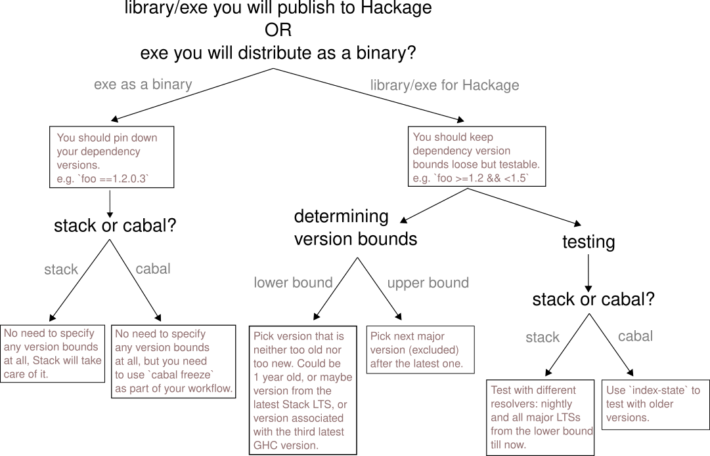

# Determining dependencies version bounds

When writing a Haskell project, be it a Stack or Cabal project, you will have a list of dependencies, for which you can specify version bounds (e.g. `filepath: >=1.2 && <1.3` where `filepath` is name of the dependency and `>=1.2 && <1.3` is its version bounds).

Sometimes it can be hard to figure out if you should specify version bounds for your dependencies at all or not, and if yes, how do you determine the bounds?
Here we are going to explain the reasoning that should help answer those questions.

First question is: are we defining dependencies for a library or an executable?

> NOTE: Haskell ecosystem is not using SemVer as a versioning policy, instead it is using [PVP](https://pvp.haskell.org/).
It is very similar but instead of `MAJOR.MINOR.PATCH` it is `MAJOR.MAJOR.MINOR.PATCH`.
So first two numbers together make a `MAJOR` component in the version.

## Executable

If you are defining dependencies for an executable, then you want to keep the version bounds as tight as possible, ideally completely fixed, so that you have consistency between builds.

Where this consistency is most important is when running tests vs building the release version of your executable -> you want to be sure that same dependency versions were used when testing the executable as when it was being built for release, because otherwise you might have untested behaviour become a part of your release. Even if dependency changed only with a "patch" change, e.g. from `1.0.0.0` to `1.0.0.1`, which could happen if your bounds are `>=1.0 && <1.1` and version `1.0.0.1` just got released, it might be that author of that change made a mistake and while fixing one bug introduced a new bug that you are not aware of and that you didn't run through tests.

Other than that, it is also convenient when all developers that are working on the project are using exactly the same dependency versions, because you avoid some of the "it works on my machine" problems and you also have them constantly testing, in a way, the final solution by running it locally (disclaimer: this is in no way replacement for automated testing).

This is true for any language, not just Haskell -> for example in Javascript/npm this is achieved by using package.lock.json.

### Stack

If you are using Stack, there is nothing you need to do, this is already taken care of due to Stack snapshots (specified by Stack resolver) which fix dependency versions and GHC version.

Therefore you can completely skip specifying any version bounds for your dependencies: they are determined by the stack resolver (as specified in your stack.yaml).

### Cabal

If you are using Cabal, the best solution is to use `cabal freeze` command, which will generate `cabal.project.freeze` file that you should include in your version control.

`cabal.project.freeze` contains exact versions of all the dependencies (and their dependencies, recursively) as they were resolved by `cabal` at the moment of running `cabal freeze`.

This way you are fixing the exact versions of your dependencies and there is no need to specify the version bounds in `<myproject>.cabal` file.

When you want to update the dependencies or add a new dependency, you should update `<myproject>.cabal` file accordingly, run `cabal freeze` to regenerate the `cabal.project.freeze`, and again have that commited to your version control.

To also fix the version of GHC, you can define `with-compiler: ghc-8.10.4` in the `cabal.project` file.

## Library

If you are defining dependencies for a library that you will publish on Hackage to be used by others, you want to keep the version bounds of your dependencies loose, to make it easier for your library to be used alongside other libraries. So exactly the opposite approach then when dealing with an executable.

Why is this important? When `cabal` is resolving dependencies, there are often situations where there are multiple dependencies depending on a same dependency (e.g. both `foo` and `bar` depend on `base`), and then `cabal` needs to figure out a version of that common dependency (e.g. `base`) that satisfies version bounds specified by both dependers (e.g. `foo` and `bar`). If `foo` and `bar` have tight version bounds for `base` that don't have any overlap, e.g. `foo` has `base: ==1.2.*` and `bar` has `base: ==1.3.*`, then `cabal` will not be able to find a version of `base` that satisfies both. This is why it is important that libraries have loose version bounds, to increase the chance that `cabal` will be able to find the version of common dependency that satisfies all of its dependers, even if there is a bunch of them.

So, loose version bounds mean that your library can play nicely with other libraries.

That said, how do you determine those version bounds, how loose should they actually be?

The main constraint we have to think about here is that you want to ensure your library will work against the different combinations of dependency versions that are inside specified version bounds.
This requirement is opposite to wanting to have loose version bounds, since the looser they are, the harder it is to ensure our library works against them.
Therefore, we want to have as loose bounds as possible while still keeping our library maintainable / testable.

For an example, if your library has dependencies `foo: >=1.0 && <2.0` and `bar: >=3.5 && <3.6`, you would want to ensure that it works correctly if `cabal` resolves `foo` to `1.0` and `bar` to `3.5`, but it should also work if it resolves `foo` to `1.4` and `bar` to `3.5.1`, or `foo` to `1.9.1` and `bar` to `3.5.0.1`, and so on and on, because you just can't know in advance what `foo` and `bar` will be resolved to.

Obviously there is a huge amount of combinations here (especially when there are plenty of dependencies and not just two) and we can't possibly run tests for all of them.

However, there are proven practical ways to have pretty good confidence in your version bounds while still keeping them loose enough and without testing all of the combinations, so let's explore those.

We can split the problem into two sub-problems:
1. Determining initial version bounds, when you add a dependency for the first time.
2. Updating version bounds for existing dependencies as time goes.

### Determining initial version bounds

Let's say you are adding a new dependency to your library -> how do you determine version bounds that are loose enough, but you can be pretty sure your library will work for the whole range?

We can further split this problem into two sub-problems:
1. Determining lower bound.
2. Determining upper bound.

#### Lower bound

What you want here is to pick a version that is not too old nor too new.

If it is too old, you are making life harder for yourself since you have a bigger range of versions for which you need to guarantee that your library works correctly.
On the other hand, you don't get much benefits from choosing such an old version since most of the other libraries (that are being kept up to date) are probably not using such an old version of this dependency anyway.

If it is too new, you are cutting it tight and risk having version bounds that are not loose enough.

How do you figure out what is the right spot between "old" and "new" though? How do you quantify "old" or "new"?

You could go with a simple rule like this: find the newest major version that is at least 1 year old and go with that.

As a more advanced approach, you can learn more about the dependency package itself in order to determine the best lower bound:
- If it is a very stable package that doesn't change much through time, you can pick a much older version.
- You could go through the changelog of the package to understand how it changed and how those changes affect the way you use it in your library, and then pick the oldest version that you think will work based on that.
- You could check out the version of the package in the current Stackage LTS and go with that. If you want to be a bit more inclusive, you can pick a bit older LTS.
- You could find other popular packages that are using this dependency and check out what are they using as a lower bound for it.

#### Upper bound

For the upper bound, safest option is to set it to the next major version (excluded) after the latest version of the package.

So, if the latest version of the package is `2.3.0.1`, your upper bound would be `<2.4`, ensuring no breaking changes happen.

If you want to be a bit more adventurous, you could investigate the package and try to predict the changes future major versions might bring based on the changelog and previous changes.
By comparing that against the way you are using that library, you could figure out a more relaxed upper bound that has a good chance of working in the future and go with that.
That way you buy more time until the next time you will need to update the version bounds, but you also increase the risk of your library breaking with time.
If not confident, it is probably best to keep it simple and stick with the next major version, and you will update the bound when the time comes.

Again, same as for lower bound, you could also take a look at how other packages out there define upper bound for this dependency and learn something from that.

### Updating version bounds

Let's say some time has passed since you defined the version bounds for dependency `D` and you feel your upper bound for it is getting "old", or somebody opened an issue saying that it is too old, or you want to pull in the newer version to get new features / bug fixes that you need.
This means it is time to update those version bounds!

#### Upper bound

This is relatively simple -> you use the same approach as you did before, when determining initial bounds.

#### Lower bound

You could leave the lower bound as it is, since you already tested against it before and there are good chances your library still works ok with that version of dependency.

However, at some point you will probably want to update it -> if it is really old then you are getting almost nothing from keeping it so old, and you are increasing the range of versions you need to test with.

When you decide to update it, you use the same approach as when defining initial dependencies.

### Testing in regards to version bounds

As mentioned before, you want to ensure that your library works correctly with any valid combination of possible dependency versions as defined by version bounds.
Ideally you would test all these combinations, but that is not possible in practice as it is too resource intensive.

The simplest practical solution is to run tests once for the oldest versions that fit into version bounds, and to also run tests with the latest versions that fit into version bounds.
You could do this once you define initial bounds.

Then, as you update dependencies, you would always be testing with the current latest versions (manually or in CI), and hope that your library still works with the older versions.

More advanced approach might be to run multiple rounds of tests each time you update dependencies -> one round with the oldest versions, and one round with the newest versions.
Maybe even with some of the versions in between.

Easy way to test with versions of different age is to run tests while using different Stack resolver, if you are using Stack to build your library.
So, you could run tests twice, once with the latest LTS and once with the nightly resolver. Or, you could run them three times, once with the older LTS, once with the current LTS, and once with the nightly resolver.

If you are using cabal to build your project, you can achieve the same thing (travel into past) by using `index-state` configuration option, which tells cabal to use Hackage as it was at the specified time.
You would then run tests once with no index-state set, so that latest versions are used, and then you would run it with `index-state` set to such point in time that it uses versions that are close to the lower bounds of your version bounds.
And finally you could also run it with `index-state` set to points in time in between now and that oldest `index-state`, to cover the middle ground.

Finally, you could (and probably should) run these tests in the CI instead of manually, ensuring that your library is always tested againt different sets of versions.

For an example of such CI workflow, you can take a look at https://github.com/wasp-lang/strong-path/blob/master/.github/workflows/ci.yaml .

### Example

Let's say I have a library that depends on `template-haskell` (TH) and I need to determine the version bounds for it.

I am using TH for the first time and I am still new to it, but I am pretty sure I am using the basic, core features and nothing especially exotic or new.

Looking at https://hackage.haskell.org/package/template-haskell and clicking on the listed versions a bit, I see that `2.16` version is a bit more than a year old (time at the moment of writing this is Nov 2021).
So that could be a good candidate for the lower bound.

Looking at the changelog, I see that `2.16` introduced `reifyType` which I am actually using (so I was wrong about not using new features), so I should stick to `2.16` and not go any older, unless I am ready to modify my code in order to support older versions of TH.

I want to take a look at other packages using TH, so I use https://packdeps.haskellers.com/reverse to search for them and I see they either specify no version bounds at all, or they vary a lot in what they use for lower bound, with almost none of them going newer than `2.16`, so I decide to stick with `2.16` for lower bound. I also see that they mostly use the next major version as an upper bound, so I will also go with that and use `2.19` as an upper bound (since the latest version is `2.18`).

As a final check, I take a look at latest Stackage LTS and I see that it uses `2.16` version of TH. That indicates I should not go newer than `2.16`, and I already concluded I don't want to go older than `2.16`, so `2.16` it is for a lower bound.

To ensure my library works well for different versions, and since I am using Stack to build it, I run tests via stack first with the LTS resolver, which uses TH `2.16`, and then I run tests via stack with the nightly resolver, which uses TH `2.17`.

All tests pass, but I am not feeling great about not testing `2.18` version of TH. Therefore, I decide to lower the upper bound to `2.18` for now, just to be safe.

Finally, my version bounds are `>=2.16 && <2.18`.

I also ensure my CI workflow runs tests twice -> first with the latest LTS, and then with the nightly resolver.

### Diagram

TODO: haskell-ci? tested-with:?

## Resources
- https://www.reddit.com/r/haskell/comments/d4o7d6/how_should_you_choose_version_bounds_for_library/
- https://www.reddit.com/r/haskell/comments/qhn8es/how_do_i_figure_out_dependency_version_bounds_for/
